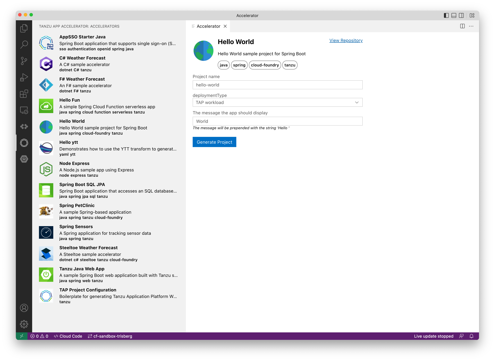
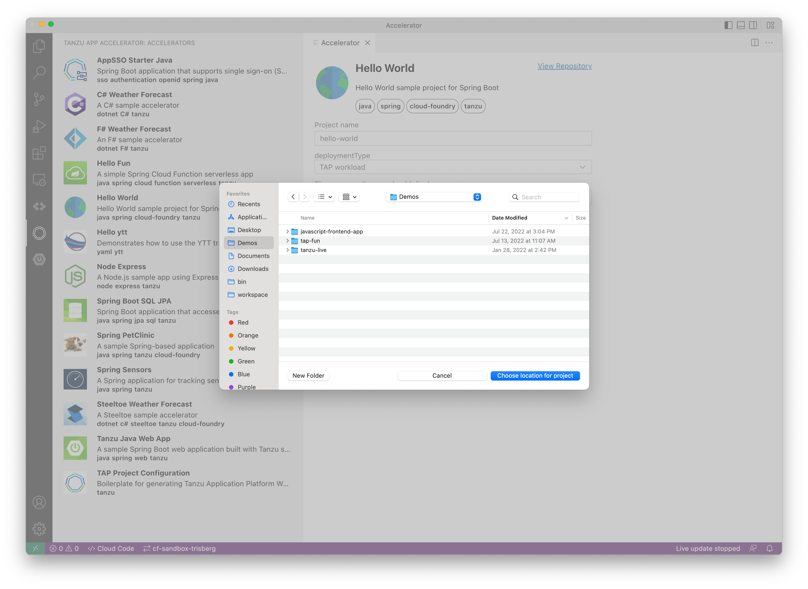
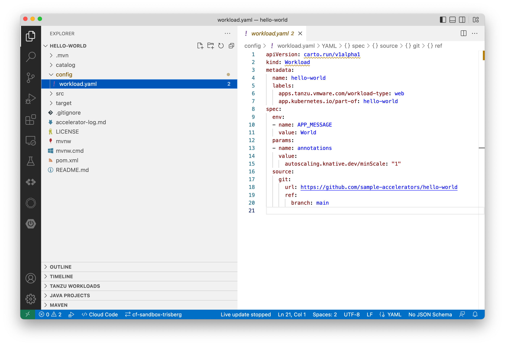
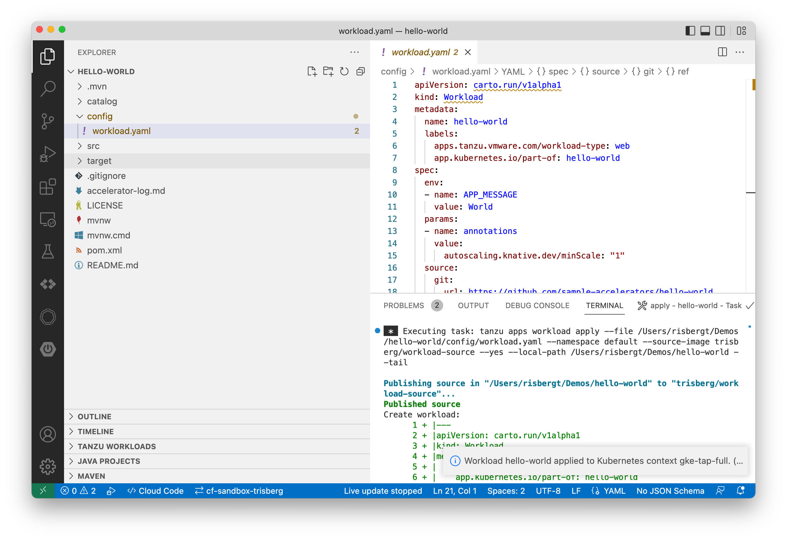
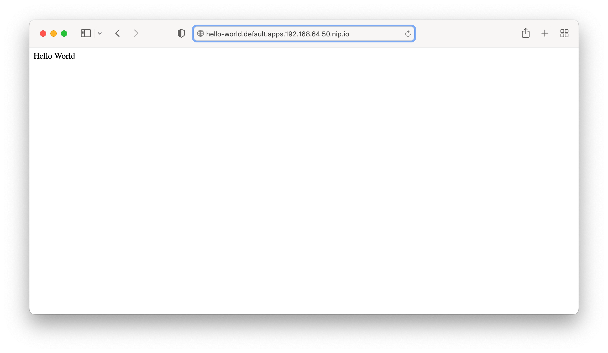

# Local installation of TAP for Accelerator developers

## Pre requsites

Install [minikube](https://minikube.sigs.k8s.io/docs/start/) and [kubectl](https://kubernetes.io/docs/tasks/tools/#kubectl).

You will need the `hyperkit` driver for macOS and `kvm2` driver for Linux. See the [Driver](https://minikube.sigs.k8s.io/docs/drivers/) page in the minikube docs.

Install [Carvel tools](https://carvel.dev/#install).

## Install TAP CLI and VSCode Extensions

See: 

- [ Install or update the Tanzu CLI and plug-ins](https://docs-staging.vmware.com/en/VMware-Tanzu-Application-Platform/1.2/tap/GUID-install-tanzu-cli)html#install-or-update-the-tanzu-cli-and-plugins-3
- [Installing Tanzu Developer Tools for Visual Studio Code](https://docs-staging.vmware.com/en/VMware-Tanzu-Application-Platform/1.2/tap/GUID-vscode-extension-install.html)
- [Application Accelerator Visual Studio Code extension - Installation](https://docs-staging.vmware.com/en/VMware-Tanzu-Application-Platform/1.2/tap/GUID-application-accelerator-vscode.html#installation-1)

## Create local minikube cluster

> You are going to need a pretty beefy system for this.

On macOS use:

```
minikube start --kubernetes-version=1.23.9 --cpus=8 --memory=8g --driver=hyperkit
```

On Linux use:

```
minikube start --kubernetes-version=1.23.9 --cpus=8 --memory=8g --driver=kvm2
```

### LoadBalancer

Figure out IP range to use for metallb (adjust for your network):

```
minikube ip
```

```
192.168.64.16
```

Use the minikube ip to determine the subnet and pick a range that isn't conflicting to configure the load balancer:

```
minikube addons enable metallb
minikube addons configure metallb
```

```
-- Enter Load Balancer Start IP: 192.168.64.50
-- Enter Load Balancer End IP: 192.168.64.60
    ▪ Using image metallb/controller:v0.9.6
    ▪ Using image metallb/speaker:v0.9.6
✅  metallb was successfully configured
```

## Install cluster-essentials

Download artifacts, see: https://docs.vmware.com/en/Cluster-Essentials-for-VMware-Tanzu/1.2/cluster-essentials/GUID-deploy.html#download-artifacts-from-tanzu-network-3

Set the install variables:

```
export INSTALL_BUNDLE=registry.tanzu.vmware.com/tanzu-cluster-essentials/cluster-essentials-bundle@sha256:e00f33b92d418f49b1af79f42cb13d6765f1c8c731f4528dfff8343af042dc3e
export INSTALL_REGISTRY_HOSTNAME=registry.tanzu.vmware.com
```

Set your TanzuNet credentials:

```
export INSTALL_REGISTRY_USERNAME=<<TANZU-NET-USER>>
export INSTALL_REGISTRY_PASSWORD=<<TANZU-NET-PASSWORD>>
```

Do the install:

```
cd $HOME/tanzu-cluster-essentials
./install.sh --yes
```

## Prepare for TAP

### Create registry secret

```
kubectl create ns tap-install
```

```
tanzu secret registry add tap-registry \
  --username ${INSTALL_REGISTRY_USERNAME} --password ${INSTALL_REGISTRY_PASSWORD} \
  --server ${INSTALL_REGISTRY_HOSTNAME} \
  --export-to-all-namespaces --yes --namespace tap-install
```

### Set TAP version

```
export TAP_VERSION=1.2.1-build.5
```

### Install package repository

```
tanzu package repository add tanzu-tap-repository \
  --url ${INSTALL_REGISTRY_HOSTNAME}/tanzu-application-platform/tap-packages:${TAP_VERSION} \
  --namespace tap-install
```

## Install TAP

### Create the tap-local-values.yaml file

Clone the [tap-local](https://github.com/trisberg/tap-local) repo:

```
git clone https://github.com/trisberg/tap-local.git
```

Copy the sample config file `tap-local/tap-local-values.yaml` to your `${HOME}/tanzu` directory and update with your Git repo credentials. Anything within `<<...>>` double angle brackets must be updated with your values. This includes the `<<INGRESS_DOMAIN>>` that should be replaced with the value you specified above for `Load Balancer Start IP` + `.nip.io` like `192.168.64.50.nip.io`.

### Install the tap package

> This could take a bit of time, be patient ...

```
cd $HOME/tanzu
tanzu package -n tap-install install tap -p tap.tanzu.vmware.com -v ${TAP_VERSION} --values-file tap-local-values.yaml
```

You can check on progress using:

```
tanzu package -n tap-install installed list
```

### Install sample accelerators

```
kubectl apply -n accelerator-system -f https://raw.githubusercontent.com/sample-accelerators/metadata/main/sample-accelerators-1-2.yaml
```

### Connect to the TAP systems

You can access the TAP-GUI using a `tap-gui` prefix for the `shared.ingress_domain` like http://tap-gui.192.168.64.50.nip.io just use the Guest account.

You can access the Accelerator server using `accelerator` prefix like http://accelerator.192.168.64.50.nip.io when configuring `Acc Server Url` for the Accelerator VSCode Extension.

You can test the access to the Accelerator server using:

```
curl http://accelerator.192.168.64.50.nip.io/api/about
```

## Setup the developer namespace

Follow the installtion instructions to [Set up developer namespaces to use installed packages](https://docs.vmware.com/en/VMware-Tanzu-Application-Platform/1.2/tap/GUID-set-up-namespaces.html)

### Set env vars

```
docker_id=<<DOCKER_ID>>
docker_password=<<DOCKER_PASSWORD>>
your_namespace=<<YOUR_NAMESPACE>>
```

### Add registry credentials

```
tanzu secret registry add registry-credentials --server "https://index.docker.io/v1/" --username ${docker_id} --password ${docker_password} --namespace ${your_namespace}
```

### Add secrets, a service account, and RBAC rules

```
cat <<EOF | kubectl -n ${your_namespace} apply -f -
apiVersion: v1
kind: Secret
metadata:
  name: tap-registry
  annotations:
    secretgen.carvel.dev/image-pull-secret: ""
type: kubernetes.io/dockerconfigjson
data:
  .dockerconfigjson: e30K
---
apiVersion: v1
kind: ServiceAccount
metadata:
  name: default
secrets:
  - name: registry-credentials
imagePullSecrets:
  - name: registry-credentials
  - name: tap-registry
---
apiVersion: rbac.authorization.k8s.io/v1
kind: RoleBinding
metadata:
  name: default-permit-deliverable
roleRef:
  apiGroup: rbac.authorization.k8s.io
  kind: ClusterRole
  name: deliverable
subjects:
  - kind: ServiceAccount
    name: default
---
apiVersion: rbac.authorization.k8s.io/v1
kind: RoleBinding
metadata:
  name: default-permit-workload
roleRef:
  apiGroup: rbac.authorization.k8s.io
  kind: ClusterRole
  name: workload
subjects:
  - kind: ServiceAccount
    name: default
EOF
```

## Configure VSCode extensions

Open VSCode and open the `Settings` menu using keys `Ctrl ,` on Linux and `Command ,` on macOS. In the `Serch settings` bar type in `Tanzu`.

- Scroll down to **Tanzu: Source Image** and enter the name of a repository to use for source images. I use `docker.io/trisberg/app-source`. 
- Scroll down to **Tanzu-app-accelerator: Acc Server Url** and enter the URL for the accelerator server. This is the `shared.ingress_domain` specified in the `tap-local-values.yaml` prefiexed woth `http://accelerator.`. With my setup I use `http://accelerator.192.168.64.50.nip.io`.

## Create the first TAP application

Click on the Tanzu icon in the navigation bar to the left and select the "Hello World" accelerator. For the `deploymentType` option select `TAP workload`.



Then click on **[Generate Project]** and pick a location for the generated project.



This should open up the generated project in a new window. Select the `config\workload.yaml` file.



You can now rihgt-click on the `config\workload.yaml` file and select `Tanzu: Apply Workload`. Tha should deploy the workload and open up a terminal where you can see the output from the deployment.



Once the build completes and the app start up you should be able to open the URL in the browser. The URL should be `http://hello-world.<namespace>.apps.` plus the `shared.ingress_domain`. For my deployment it was `http://hello-world.default.apps.192.168.64.50.nip.io`


